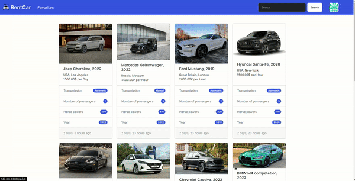

# RentCar 🚘



---
## Description
A website where people will be able to post ads about rental their car.
In description, they can specify features of the car(rental price, year,
HP, transmission, number of passengers).

You can find a car by make, number of rental days, city and country that
will be specified in the tags and description. You will also be able to add 
and delete a photo of your car.

People will also have the opportunity to view the profile of private 
owner and organizations.

---

## Features
- 🖼 The ability to add photos to the ad.
- 🔍 Searching by tags, title, text, country and city.
- 💛 The ability to add to favorites.
- ✔ Users will be able to access other people's profiles, leave feedback 
on the deal and view their ads.

---
## Tech

- [HTML/CSS JS](https://developer.mozilla.org)
- [Bootstrap](https://getbootstrap.com/)
- [jQuery](https://jquery.com/)
- [Python](https://www.python.org/)
- [Django](https://www.djangoproject.com/)

## Installation
- Clone the repository to your computer:
  - ```git clone https://github.com/RolanIm/RentCars.git```
- Install and create the virtual environment:
    - for windows: ```python -m venv venv```
    - for Unix/macOS: ```python3 -m venv venv```
- Activate a virtual environment:
  - for windows: ```source venv/Scripts/activate```
  - for Unix/macOS: ```source venv/bin/activate```
- Install dependencies from the file requirements.txt: 
  - ```pip install -r requirements.txt```
- Make migrations
	- ```python manage.py makemigrations```
	- ```python manage.py migrate```
- Run the `manage.py` file:
  - ```python manage.py runserver```
- Go to the site using the link http://127.0.0.1:8000/

---
## Author
### [_Rolan Imangulov_](https://github.com/RolanIm)

---
## License

MIT

[//]: # (These are reference links used in the body of this note and get stripped out when the markdown processor does its job. There is no need to format nicely because it shouldn't be seen. Thanks SO - http://stackoverflow.com/questions/4823468/store-comments-in-markdown-syntax)
